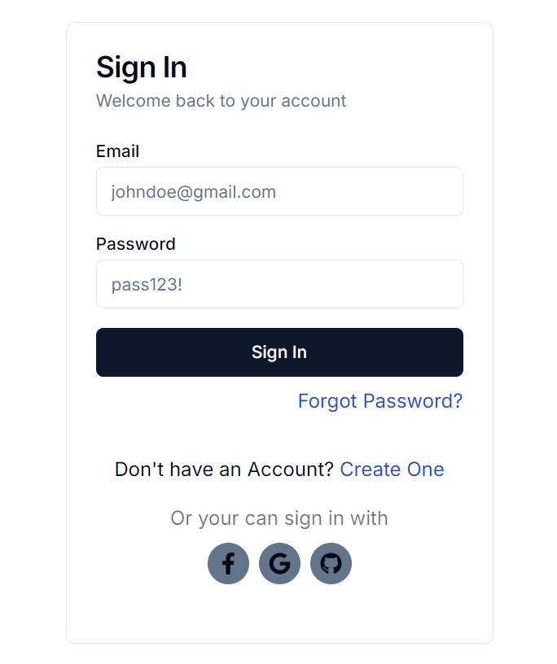
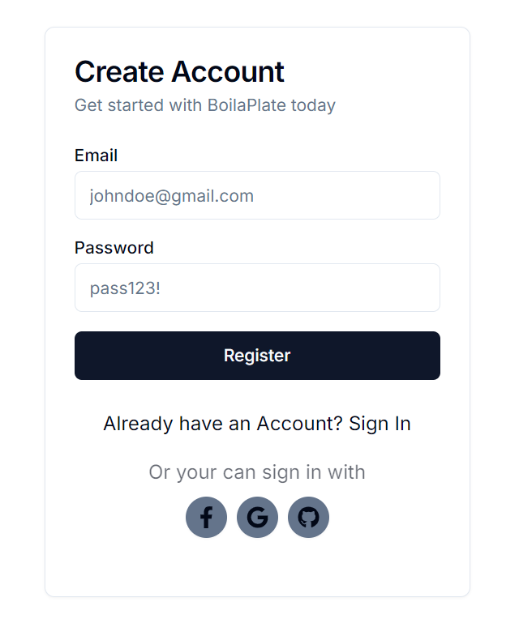
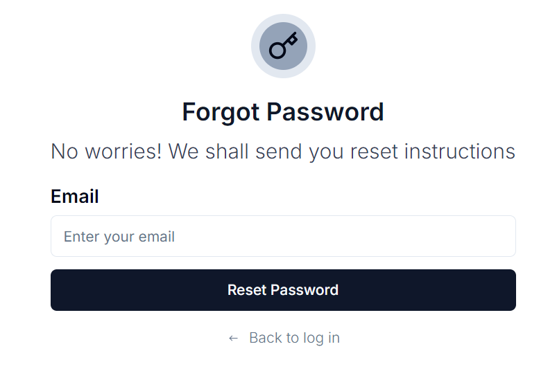
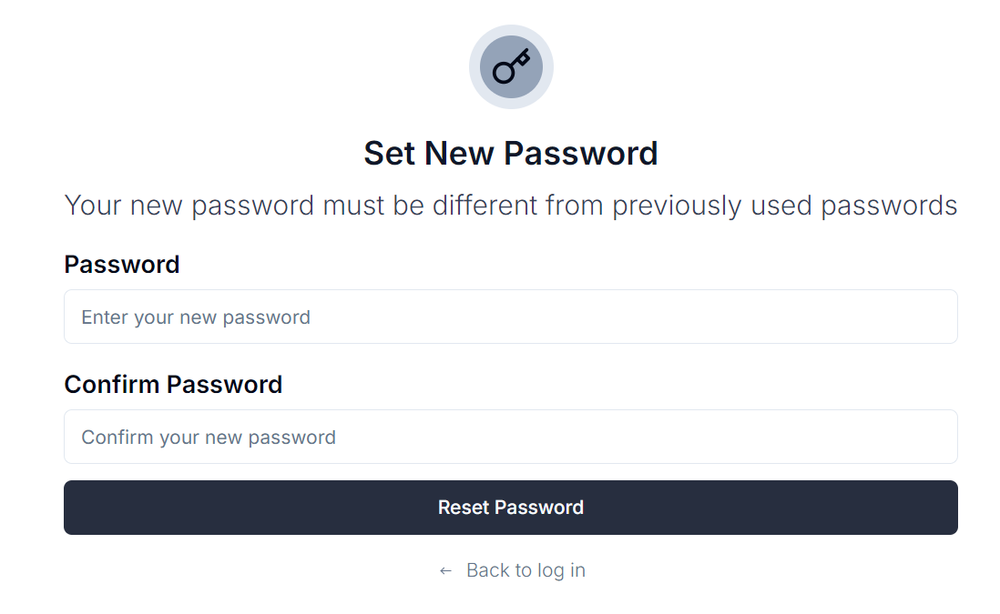
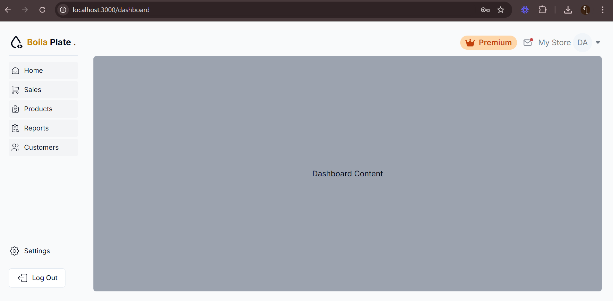
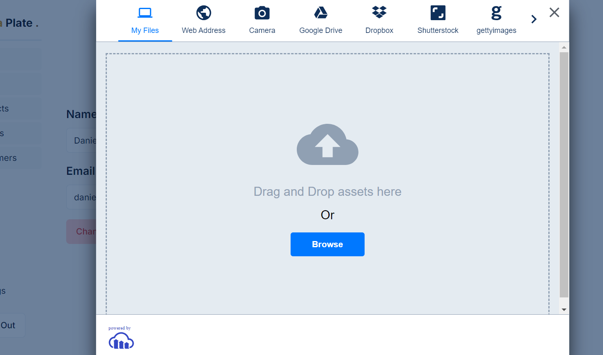
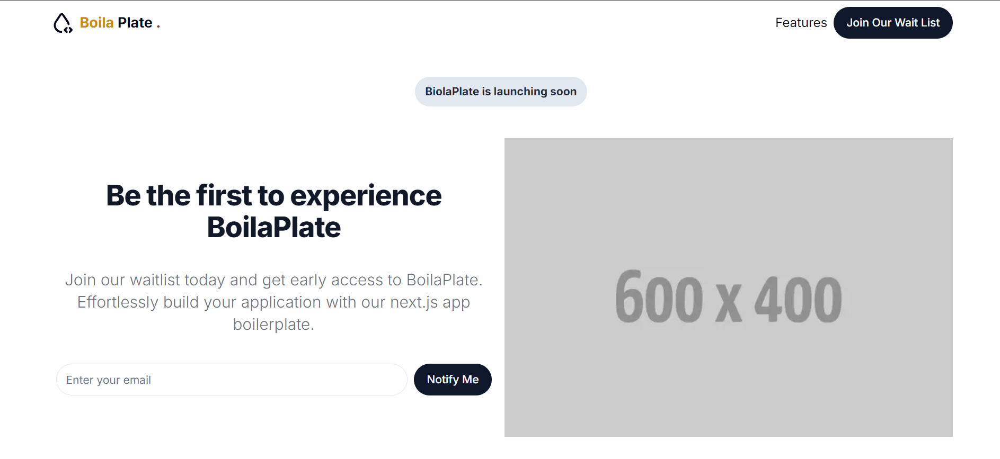

# Pages Overview

The Next.js boilerplate comes equipped with essential authentication pages, dashboard views, and a landing page to help you kickstart your project quickly. Each page is pre-configured with a clean UI, responsive layout, and ready-to-use functionality, saving you valuable time on development.

Below is an overview of all the key pages included in **BoilaPlate**.

---

## 1. Sign In Page (`/auth/signin`)

The **Sign In** page provides a simple and secure authentication process for users. It integrates with **NextAuth** for easy user management and email/password authentication.

- **Route**: `/auth/signin`
- **Components**: Sign-in form with fields for email and password.
- **Additional Info**: Utilizes secure NextAuth session handling.

This page alone saves you several hours of development time because it’s already set up to connect with authentication services and handle validation.

---

## 2. Register Page (`/auth/register`)

While **NextAuth** doesn't offer a registration feature out of the box, **BoilaPlate** includes a fully functional **Register** page. This page allows users to create new accounts using a custom route (`/api/auth/register`), which processes new user registrations.

- **Route**: `/auth/register`
- **Components**: Registration form with fields for email, password, and confirmation password.
- **Additional Info**: Secure account creation, easy integration with database.

The registration page is already configured to store user data in **MongoDB**, saving you at least 5 hours of backend setup.

---

## 3. Forgot Password Page (`/auth/forgot-password`)

The **Forgot Password** page allows users to reset their password by sending an email to their registered address. It’s integrated with the **Resend** service, using **@react-email/components** to handle beautifully styled email templates.

- **Route**: `/auth/forgot-password`
- **Components**: Email input field, submit button to request password reset.
- **Additional Info**: Connects to API to send reset emails using Resend and React Email.

This feature is already integrated into the backend logic, saving you 3-4 hours of development time.

---

## 4. Reset Password Page (`/auth/reset-password`)

The **Reset Password** page allows users to securely update their passwords after verifying their identity via email. It’s linked to the token-based reset system, ensuring secure operations.

- **Route**: `/auth/reset-password`
- **Components**: Password input fields (new password and confirmation password).
- **Additional Info**: This page ensures user verification before allowing password changes.

The backend logic of password resets can often take several hours to implement, but **BoilaPlate** handles it for you right out of the box.

---

## 5. Dashboard Page (`/dashboard`)

The **Dashboard** page provides users with an overview of their account. The page includes:

- A simple **logout button** to allow users to sign out securely.
- **Navigation links** for profile management and other dashboard pages.
- A **Premium badge** to highlight users who have upgraded.
- A **Upgrade to Premium** button for users to purchase premium access (integrated with **Lemon Squeezy**).

While the dashboard is basic, it sets up the foundational layout for a more advanced system. You can easily build on top of this for customized user experiences.

- **Route**: `/dashboard`
- **Components**: Navigation, logout button, premium badge.

This dashboard layout alone can save you 4-5 hours of work, providing a base UI that developers can expand upon.

---

## 6. Profile Page (`/dashboard/profile`)

The **Profile** page enables users to update their account information, such as email, name, and profile picture.

- **Route**: `/dashboard/profile`
- **Components**: Editable form for updating user details (email, name, profile picture).
- **Additional Info**: Data is securely updated in the database.

This page saves you from setting up user profile management from scratch, typically a 3-4 hour task.

---

## 7. Home (Landing Page)

The **Home** page serves as the **Landing Page** for your web application. It's a beautifully designed page with sections for **features**, **testimonials**, and **call-to-action** buttons for new users to register or learn more.

- **Route**: `/`
- **Components**: Hero section, feature highlights, call-to-action buttons.
- **Additional Info**: This page is highly customizable for your product or service.

Having a ready-made, responsive landing page saves you significant time—up to 10 hours—allowing you to focus on customization rather than starting from scratch.

---

## 8. Waitlist Page (`/wait-list`)

The **Waitlist** page is designed to capture potential users’ emails, allowing them to sign up for your service when it becomes available.

- **Route**: `/wait-list`
- **Components**: Email input field, submit button.
- **Additional Info**: Stores waitlist information in the database, ready for future use.

Having a waitlist page in your app helps create buzz and anticipation, and the pre-built page saves you 2-3 hours.

---

# Time Saved with Pre-built Pages

By using **BoilaPlate**, you save a significant amount of time on setting up the essentials:

- **Authentication pages** (Sign In, Register, Forgot/Reset Password) are pre-built with secure and scalable functionality.
- **Dashboard** and **Profile** pages are ready for expansion, allowing you to focus on advanced features without worrying about basic user navigation.
- **Landing** and **Waitlist** pages help you quickly set up a professional-looking front end.

In total, you’re saving up to **30-40 hours** of development time by using these pages as part of the **BoilaPlate**.

